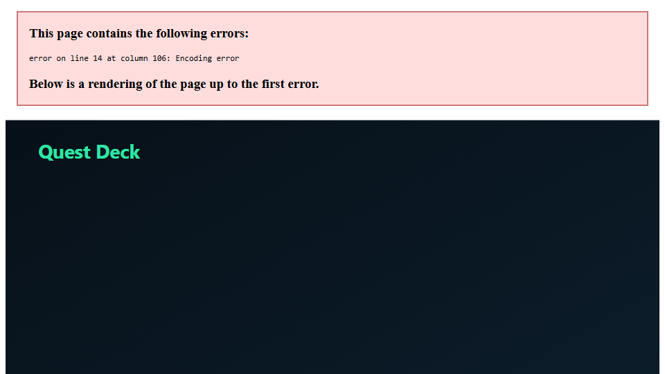
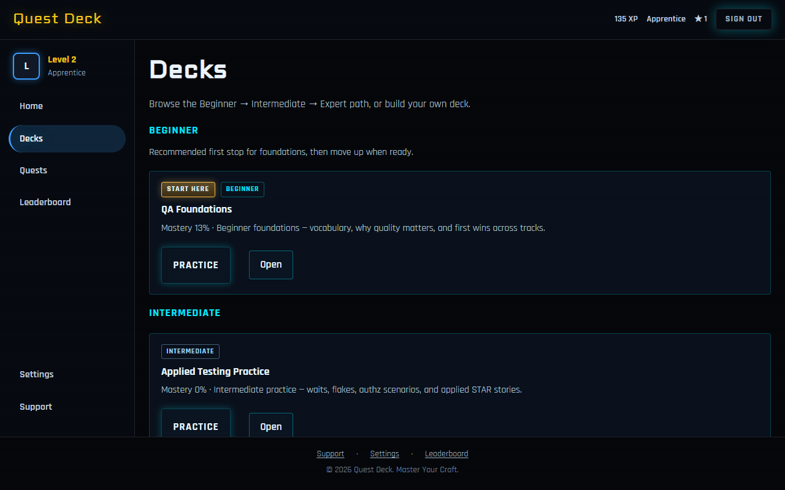

# qa-platform-lab

[](https://github.com/greatmindsinside/qa-platform-lab/actions/workflows/ci.yml)
[](LICENSE)

**Quest Deck** is a gamified QA/SDET interview-prep app, owned end-to-end as a TypeScript quality proof (unit → API → E2E → cross-layer).





> **Status:** App MVP is runnable locally and via Docker. PR CI runs lint, typecheck, unit, and `@smoke`; `main` runs the full Playwright suite and uploads the HTML report. Spec packages cover the product through learning path (`003`) and adventure (`005`); memory tips (`004`) are specified and planned next.

## Why this repo (for employers)

- **Owned AUT:** a real product under test, not a throwaway demo page
- **Layered test strategy:** Vitest unit + API inject + Playwright E2E/cross-layer, tagged (`@smoke`, `@auth`, `@rbac`, `@mutation`, `@progression`, `@a11y`, `@perf`)
- **Meaningful risk:** deck membership RBAC, XP/level/streak rules, and **per-deck practice progress / resume** covered in tests
- **Spec-Driven / TDD:** constitution → spec → plan → tasks → implement; domain rules fail first, then minimal code

## Risk map (how quality is proved)

```text
                 / \
                /E2E\          Playwright — login, deck practice/resume, path UX, adventure
               /-----\
              / API   \        Playwright HTTP — auth, RBAC delete, XP, MCQ, perf smoke
             /---------\
            /   Unit    \      Vitest — XP/streak, RBAC, MCQ grading, resume helpers, Fastify inject
           /-------------\
```

| Risk | Primary proof |
| ---- | ------------- |
| Membership RBAC (delete) | `tests/unit/rbac.test.ts`, `tests/api/rbac-delete.spec.ts` |
| XP / streak / improve bonus | `tests/unit/progression.test.ts`, `tests/api/practice-xp.spec.ts`, `tests/e2e/practice.spec.ts` |
| Per-deck progress + resume | `tests/unit/path-grouping.test.ts`, `tests/unit/api-quest-deck.test.ts`, `tests/e2e/practice.spec.ts` |
| MCQ grade + anti-cheat | `tests/unit/mcq-grading.test.ts`, `tests/api/mcq-practice.spec.ts` |
| Soft learning path / Decks dashboard | `tests/e2e/learning-path.spec.ts` |
| Adventure progression | `tests/e2e/adventure.spec.ts` |
| a11y baseline | `tests/e2e/a11y.spec.ts` |
| API latency smoke | `tests/api/perf-smoke.spec.ts` |

Deeper matrix: [docs/quality-architecture.md](docs/quality-architecture.md) · [tests/README.md](tests/README.md)

## Test inventory (approx.)

| Layer | Location | Files | Role |
| ----- | -------- | ----- | ---- |
| Unit / inject | `tests/unit/` | 11 | Domain + Fastify inject (~40 tests) |
| API | `tests/api/` | 6 | Live HTTP + perf smoke |
| E2E | `tests/e2e/` | 8 | Browser journeys + a11y + shell |
| Cross-layer | `tests/cross-layer/` | 1 | Invite API → UI |
| PR gate | `@smoke` | 17 | lint + typecheck + unit + these |

## Interview path (≤5 minutes)

1. Skim this README + the risk map above
2. [Demo script](docs/demo.md) — walkthrough with file citations
3. Open the latest [Playwright report artifact](https://github.com/greatmindsinside/qa-platform-lab/actions/workflows/ci.yml) from a green `main` run (or GitHub Pages if enabled)
4. Run smoke locally (below)

## What Quest Deck is

Practice interview cards in decks (open flip + choice questions), earn XP/levels/titles/streaks, and follow a soft Beginner → Intermediate → Expert path under **Decks**. Progress is saved **per deck and per card**; **Resume Practice** continues at the first unpracticed card. Home stays simple: progress and one Practice action. **Quests** run a short choice-driven adventure (**Flaky Friday**). Deck admins invite members; delete uses membership role, not a global admin shortcut.

Seeded demos: `admin@lab.local` / `Admin123!` and `member@lab.local` / `Member123!`.

## Stack

Node ≥ 22, Yarn 1, TypeScript, Fastify, SQLite, React/Vite, Vitest, Playwright, ESLint, GitHub Actions, Docker Compose.

## Run it (≤5 minutes)

```bash
yarn install
yarn workspace @lab/shared build
yarn workspace @lab/testkit build
yarn test:smoke
```

Prep UI:

```bash
yarn workspace @lab/shared build
yarn dev
```

Open `http://127.0.0.1:5173` (API on `3333`; Vite proxies `/api`). If 5173 is busy, Vite picks the next free port.

### Docker (optional)

```bash
docker compose up --build
```

Open `http://127.0.0.1:8080` (API also on `3333`).

## What's already in the repo

| Artifact | Link |
| -------- | ---- |
| Project constitution | [`.specify/memory/constitution.md`](.specify/memory/constitution.md) |
| MVP feature (complete) | [`specs/001-quest-deck/`](specs/001-quest-deck/) · [spec](specs/001-quest-deck/spec.md) · [plan](specs/001-quest-deck/plan.md) · [tasks](specs/001-quest-deck/tasks.md) · [API contract](specs/001-quest-deck/contracts/rest-api.md) |
| OpenAPI starter | [`docs/openapi.yaml`](docs/openapi.yaml) |
| MCQ cards | [`specs/002-mcq-cards/`](specs/002-mcq-cards/) |
| Learning path | [`specs/003-learning-path/`](specs/003-learning-path/) |
| QA adventure | [`specs/005-qa-adventure/`](specs/005-qa-adventure/) |
| Decks dashboard design | [`docs/superpowers/specs/2026-07-21-decks-dashboard-layout-design.md`](docs/superpowers/specs/2026-07-21-decks-dashboard-layout-design.md) |
| Quality architecture | [`docs/quality-architecture.md`](docs/quality-architecture.md) |
| Tests map | [`tests/README.md`](tests/README.md) |
| 5-minute demo script | [`docs/demo.md`](docs/demo.md) |

## Trade-offs / what I'd do next

- **SQLite over Postgres** for a cloneable demo DB with zero infra; swap later if multi-user hosting matters.
- **No Allure/k6/ZAP kitchen sink yet** — prefer a deep owned AUT + tagged pyramid over tool breadth; one `@perf` smoke and `@a11y` smoke are intentional thin slices.
- **Spec Kit as source of truth** so agents and humans change the product the same way.
- **Next:** implement [memory tips](specs/004-memory-tips/); optionally publish the Playwright HTML report to GitHub Pages for zero-install proof.

Out of MVP (still): AI interviewer, full SRS/Anki, OAuth, Postgres, card edit/delete. See the constitution.

## Repo map

| Path | Role |
| ---- | ---- |
| `apps/api`, `apps/web` | AUT (Fastify + React) |
| `packages/shared` | Shared types / seed contracts |
| `packages/testkit` | Playwright HTTP client (tests only) |
| `tests/` | Unit · API · E2E · cross-layer |
| `specs/` | Spec Kit feature packages (`001`–`005`) |
| `docs/` | Architecture, OpenAPI, demo |
| `docker/` + `docker-compose.yml` | One-command demo stack |
| `.github/workflows/ci.yml` | PR `@smoke` · `main` full Playwright + report artifact |

## For builders (secondary)

| Guide | Use when |
| ----- | -------- |
| [docs/README.md](docs/README.md) | Doc index |
| [CONTRIBUTING.md](CONTRIBUTING.md) | How to change the product |
| [Spec-Driven Development](docs/spec-driven-development.md) | Spec Kit loop |
| [Using Quest Deck](docs/using-quest-deck.md) | Interview prep sessions |
| [`.cursor/skills/`](.cursor/skills/) | Agent skills for specify → plan → tasks → implement |
